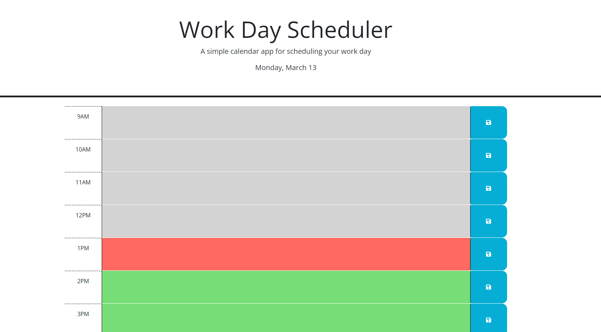

# Planner

## Description

A simple calendat planner for all the hours of the day that saves your schedule to the local storage and lets you know the current hour of the day based on the color of the time block.

## Demo

<!-- @TODO: create ticket to review/update image) -->

## Links

https://github.com/Badermah/Planner

https://planner.bader204.repl.co
